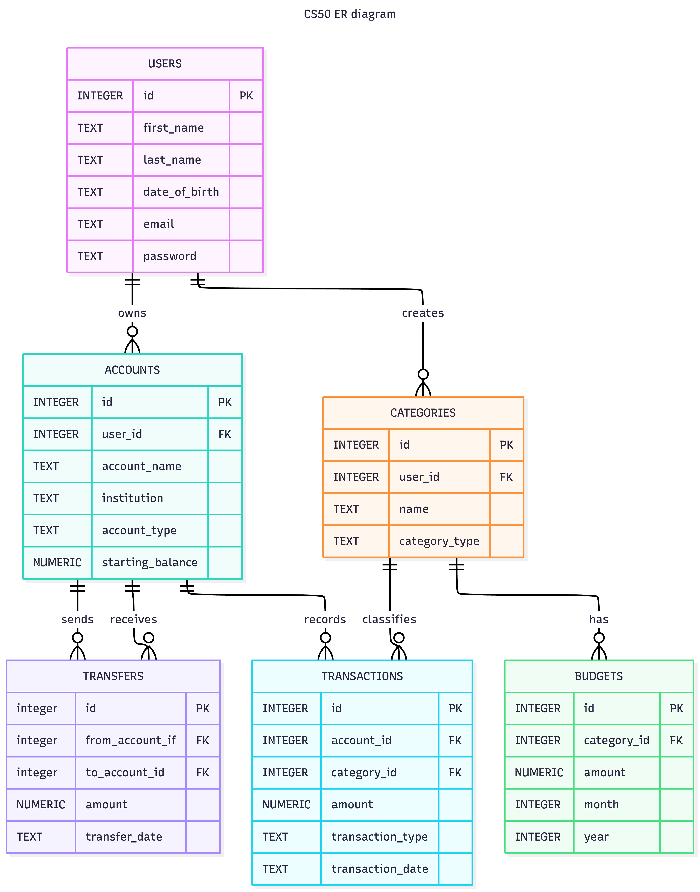

# Design Document

By Niayesh Talaie

Video overview: <https://youtu.be/qyvYuMr9jLU>

## Scope

In this section you should answer the following questions:

* What is the purpose of your database?
The purpose of this database is to help users manage and organize their personal finances. It allows users to create financial accounts, record deposits, withdrawals, and transfers, organize transactions into categories, set monthly budgets, and monitor current account balances.

* Which people, places, things, etc. are you including in the scope of your database?

The database supports registered users, their financial accounts, transaction records, transaction categories, monthly budgets, and transfers between accounts. It stores information about deposits, withdrawals, transfers, account balances, and spending categories to help users organize and analyze their financial activity.

* Which people, places, things, etc. are *outside* the scope of your database?

Users cannot connect the database directly to financial institutions, automatically import transactions, send or receive real payments, verify real account balances, or receive financial or investment advice.
--------------------------------------------------------------
## Functional Requirements

In this section you should answer the following questions:

* What should a user be able to do with your database?
A user should be able to register into the database using personal information, manage financial accounts, record deposits and withdrawls as well as transfers. Users should also be able to filter transactions by account, category, type, or date.

* What's beyond the scope of what a user should be able to do with your database?

Users cannot connect the database directly to a real bank, automatically import transactions, send or receive actual payments, verify real account balances, receive investment or financial advice

--------------------------------------------------------------
## Representation

### Entities

In this section you should answer the following questions:

* Which entities will you choose to represent in your database?

## users table:
id: uniquely identifies each user
first_name: stores the user’s first name
last_name: stores the user’s last name
date_of_birth: stores the user’s date of birth
email: stores the user’s email address
password: stores the user’s password

**The id column uses the INTEGER type because it is a numerical identifier and serves as the primary key.
**The first_name, last_name, email, and password columns use the TEXT type because they contain character-based information.
**The date_of_birth column also uses TEXT because SQLite does not have a separate date storage type.
**The email column requires a UNIQUE entry from the users.

## accounts table:
id: uniquely identifies each account
user_id: identifies the owner of the account
account_type: stores the type of account (checking, savings, credit, or investment)
institution: stores the name of the financial institution where the account is held
starting_balance: stores the account balance when the account is first created

**The id column uses the INTEGER type because it is a numerical identifier and serves as the primary key.
**account_type and institution use TEXT.
**starting_balance use NUMERIC value type since the balance might have decimal values.
**user_id is a foreign key referencing the user from the users table.
**The account_type column uses a CHECK constraint to restrict values to the supported account types (checking, savings, credit, and investment).
**The starting_balance also has defined as a defult of 0 and NOT NULL.

## categories table:
id: uniquely identifies each category
user_id: identifies the user who created the category
name: stores the category name, such as Groceries
category_type: identifies whether the category represents income or an expense

**The id column uses the INTEGER type because it is a numerical identifier and serves as the primary key.
**The id and user_id are integer.
**name and category_type are TEXT.
**The user_id is a foreign key referencing the user in the users table.
**The category_type column is NOT NULL and uses a CHECK constraint to allow only income or expense.
** UNIQUE ("user_id", "name") constraint prevents one user to create the same category twice.

## transactions table:
id: uniquely identifies each transaction
account_id: identifies the account connected to the transaction
amount: stores the monetary value of the transaction
transaction_type: identifies whether the transaction is a deposit, withdrawal, incoming transfer, or outgoing transfer
transaction_date: stores the date when the transaction occurred
category_id: identifies the category assigned to the transaction

**The id, account_id, and category_id columns use the INTEGER type because they are identifiers.
**The amount is NUMERIC, since it might have decimals.
**The transaction_date column use TEXT(YYYY-MM-DD format)
**The account_id and category_id are foreign keys, referencing accounts and categories.
**The amount column is NOT NULL and uses a CHECK constraint requiring the amount to be greater than zero.
**The transaction_type column is NOT NULL and uses a CHECK constraint to allow only (deposit,withdrawl,transfer_in,transfer_out).

## budgets table:
id: uniquely identifies each budget
category_id: identifies the category associated with the budget
amount: stores the planned monthly budget for the category.
month: stores the month
year: stores the year

**The id and category_id columns are integer.
**The amount is NUMERIC, since it might have decimals.
**month and year are also integers.
**the id column is primary key and category_id is foreign key referencing the id in the categories table.

## transfers table:
id: uniquely identifies each transfer
from_account_id: identifies the id of the transfer from the initial account
to_account_id: identifies the id of the transfer to the secondary account
amount: stores the amount of the transfer
transfer_date: stores the date when the transfer happens

**The id (primary key), from_account_id and to_account_id are integers.
**The amount is NUMERIC, since it might have decimals.
**Transfer date use TEXT(YYYY-MM-DD format).
**from_account_id is a foreign key referencing account id from accounts table
**to_account_id is a foreign key referencing account id from accounts table

### Relationships

In this section you should include your entity relationship diagram and describe the relationships between the entities in your database.

-- users --> accounts : one to many ( one user can have multiple accounts, however each account must belong to one user, NOTE: we assume that there are no multiple users option for each account )

-- users --> categories : one to many (one user can create many categories and Each category belongs to one user)

-- accounts --> transactions : one to many (one account can have one or multiple transactions but one transaction belongs to exactly one account )

-- categories --> transactions : one to many ( each category can have one or multiple transctions but each transaction belongs to one category at a time)

-- categories --> budget : one to many ( each category can have many budgets but each budget belongs to only one category)

## Optimizations

In this section you should answer the following questions:

* Which optimizations (e.g., indexes, views) did you create? Why?
INDEXES:
I created the index "transactions_by_account", so the database use account id to search faster for transactions.
additonally, "transaction_date" so the database find the transaction faster searching for the date that transaction happened.
"transfers_by_source_account" and "transfers_by_destination_account" are created to help searching for the transfer information faster using "from_account_id" and "to_account_id" indexes.

VIEWS:
1) deposit_transactions displays only deposit transactions along with their categories, allowing users to easily review incoming funds without repeatedly writing filtering queries.
2) withdraw_transactions displays only withdrawal transactions, making it easier to review expenses and spending history.
3) account_balances calculates each account's current balance by combining the starting balance with deposits, withdrawals, and transfers. This allows users to quickly view the current balance of every account without manually performing the calculations each time.

## Limitations

In this section you should answer the following questions:

* What are the limitations of your design?

- Transaction categories are assigned by the user rather than being determined automatically.
- NO direct connection to banks or online transactions.
- It does not support recurring transactions or scheduled payments.

* What might your database not be able to represent very well?
- summerizing each category and the total amount spent for each one
